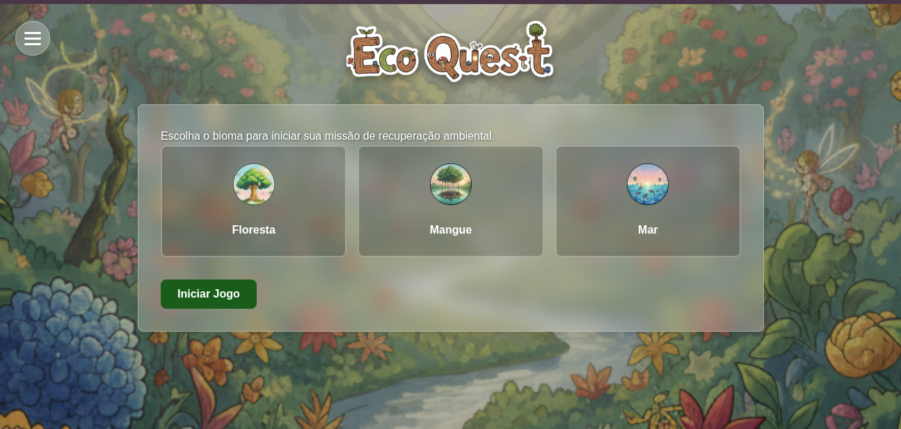
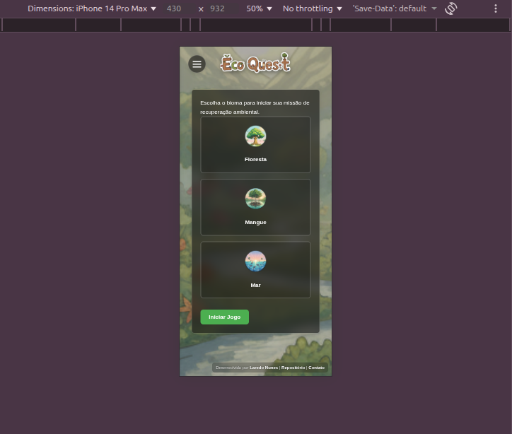
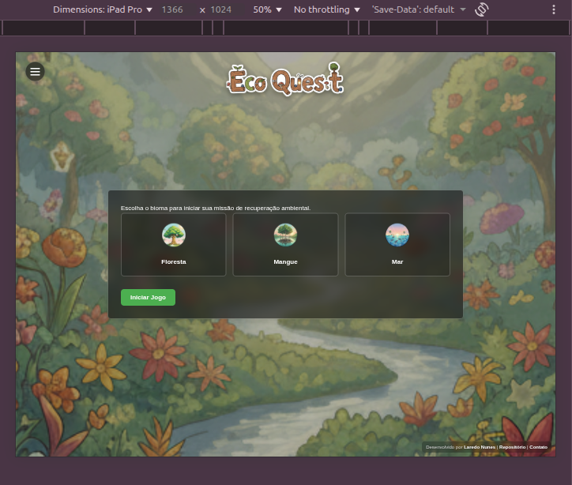
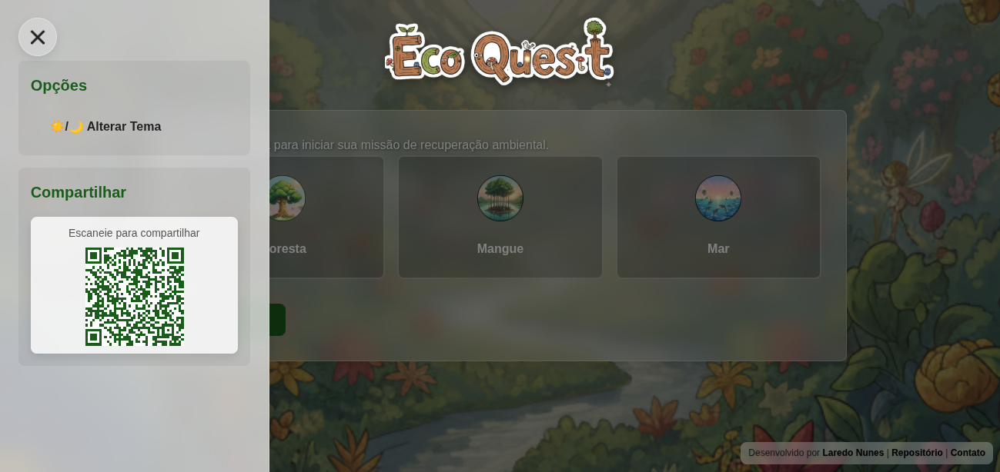
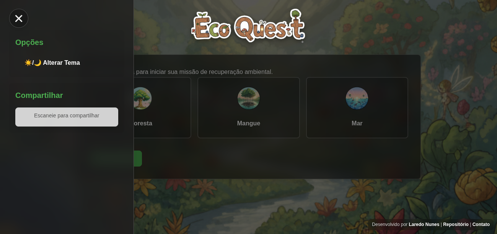
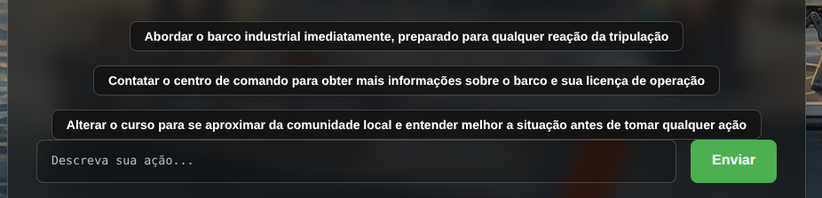
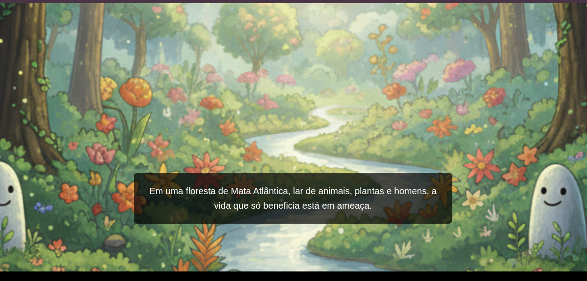
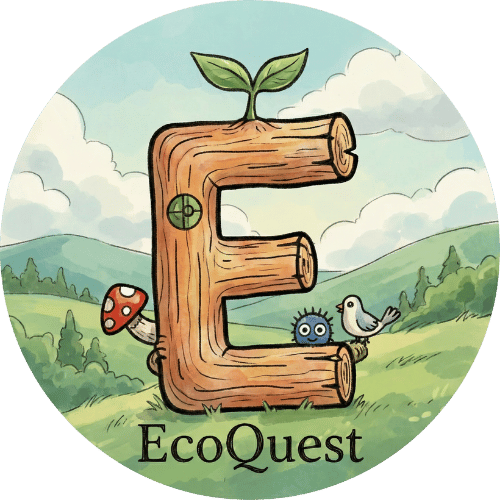

<p align="center">
  
</p>

---

# 🌱 EcoQuest — RPG investigativo ambiental inspirado pela COP30

**EcoQuest** é uma experiência narrativa interativa onde você assume o papel de um agente ambiental responsável por proteger biomas brasileiros.
Cada escolha altera a história — e o futuro da natureza.

👉 **Demo Online:** [https://imersao_dev_alura2025.igniscomputo.com](https://imersao_dev_alura2025.igniscomputo.com/)

🎥 **Vídeo Demonstrativo:** [https://youtu.be/3--hmndH-10](https://youtu.be/3--hmndH-10)

📦 **Repositório:** [https://github.com/laredonunes/ecoquest_api](https://github.com/laredonunes/ecoquest_api)

---

## 💚 Motivação

2025 é o ano da **COP30 no Brasil** — um marco global que coloca a urgência ambiental no centro do debate público.

Mas ainda existe um desafio: como engajar pessoas reais, estudantes, profissionais e crianças na proteção da natureza?

📌 **EcoQuest transforma educação ambiental em experiência jogável**, acessível e emocional.

---

## 🕹️ O que é o EcoQuest?

É um RPG curto, simples e direto, onde você:

✅ Escolhe um bioma (Floresta, Mangue ou Mar)
✅ Recebe um caso ambiental inspirado em situações reais
✅ Analisa cenários, riscos, personagens e pistas
✅ Toma decisões que afetam o ecossistema
✅ Descobre diferentes desfechos — alguns positivos, outros nem tanto

O objetivo não é ganhar, e sim **refletir**.

---

## 🎨 Interface

EcoQuest foi pensado para ser acolhedor, bonito e fácil de jogar.
Construído com **HTML, CSS e JavaScript puro**, oferece:

* layout responsivo
<p float="left">
  
  
  
</p>
* experiência mobile e desktop
<p float="left">
  
    
</p>
* modo claro/escuro
<p float="left">
  
  
</p>
* menu lateral com QR Code para compartilhar
<p float="left">
    
</p>
* botões de decisão simples e diretos
<p float="left">
    
</p>
* identidade visual lúdica e ilustrada
<p float="left">
    
</p>


---

## 🌍 Biomas disponíveis

* 🌳 **Floresta**
* 🐟 **Mangue**
* 🌊 **Mar**

Cada um possui desafios ambientais diferentes — todos presentes no Brasil.

---

## 🤖 Inteligência Artificial no Jogo

A IA é usada de forma **leve e responsável**, apenas para:

* dar fluidez à narrativa
* adaptar respostas às escolhas do jogador
* manter coerência ambiental

Ela **não controla o jogo** — apenas ajuda a contar histórias.

---

## 👩‍💻 Tecnologias Utilizadas

**Front-end**

* HTML
* CSS
* JavaScript (fetch API)

**Back-end**

* Python + Flask (API simples)

**Suporte**

* Docker (opcional, apenas para facilitar execução)
* Groq API / Gemini (narrativa adaptativa)

O foco do projeto é **experiência, criatividade e impacto**, não complexidade técnica.

---

## ▶️ Como Jogar

1. Acesse a demo online
2. Escolha seu bioma favorito
3. Leia as informações com atenção
4. Tome decisões
5. Veja o impacto de suas escolhas
6. Jogue novamente e compare finais 🌿

Não precisa instalar nada — funciona direto no navegador.

---

## 🛠️ Como Rodar Localmente (opcional)

```bash
git clone https://github.com/laredonunes/ecoquest_api.git
cd ecoquest_api
pip install -r requirements.txt
export GROQ_API_KEY="sua_chave"
python app.py
```

Acesse em:
[http://localhost:8080](http://localhost:8080)

---

## 🎓 Sobre o Desenvolvimento

Estou em **transição de carreira**, e o EcoQuest é meu **primeiro projeto completo utilizando HTML, CSS e JavaScript puro**, criado durante a **Imersão Dev com Alura e Google**.

Usei IA, materiais da Imersão e estudos complementares para aprender, testar ideias e melhorar textos — mas **todo o design, lógica, narrativa, organização e implementação são autorais**.

---

## ✨ Possibilidades Futuras

* novos biomas brasileiros (cerrado, caatinga, pampa, pantanal)
* trilhas educativas para escolas
* acessibilidade ampliada
* rankings colaborativos
* oficinas públicas durante a COP30
* integração com dados reais ambientais e pesquisas científicas

O propósito é tornar o EcoQuest uma ferramenta social aberta.

---

## 💌 Feedback, ideias & contribuições

Está convidado(a) a sugerir melhorias, novos cenários ambientais e ajustes na experiência.
Vamos construir juntos um jogo que inspira cuidado com o planeta. 💚🌎

---

## 📄 Licença

Projeto aberto para fins educacionais, sociais e ambientais.

---
<p align="center">
  <a href="http://imersao_dev_alura2025.igniscomputo.com/">
    
  </a><br>
  <a href="http://imersao_dev_alura2025.igniscomputo.com/">Clique aqui para jogar</a>
</p>

---
## 🌱 Sobre mim

Sou Laredo Nunes, servidor público e estudante em transição para tecnologia.  
Acredito no uso da computação, criatividade e IA para promover educação ambiental e impacto social.

🔗 [LinkedIn](mailto:laredonunes@gmail.com?subject=Eu+vi+seu+repositorio+do+ecoquest_api&body=Ola+meu+nome+%C3%A9+%5Bseu+nome%5D)
📧 [Email](https://www.linkedin.com/in/laredo-nunes-0a8a7363)

